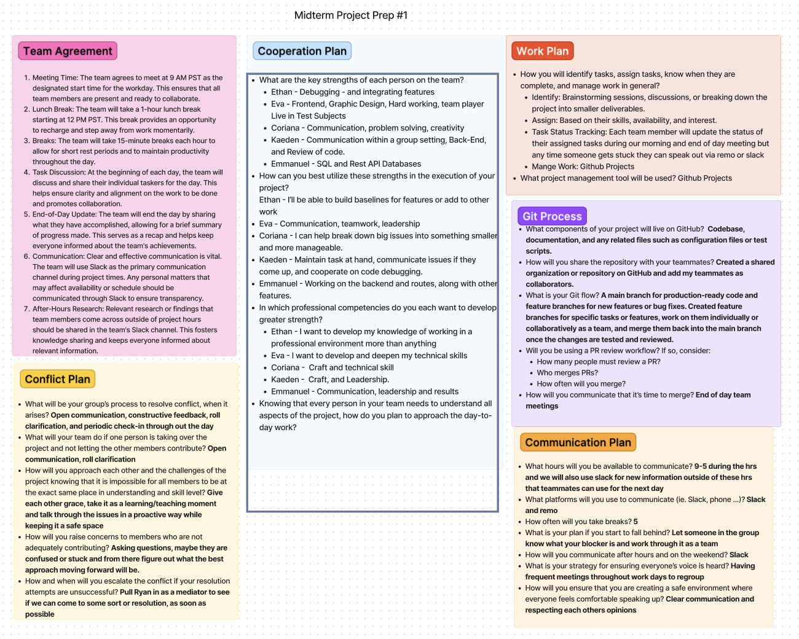
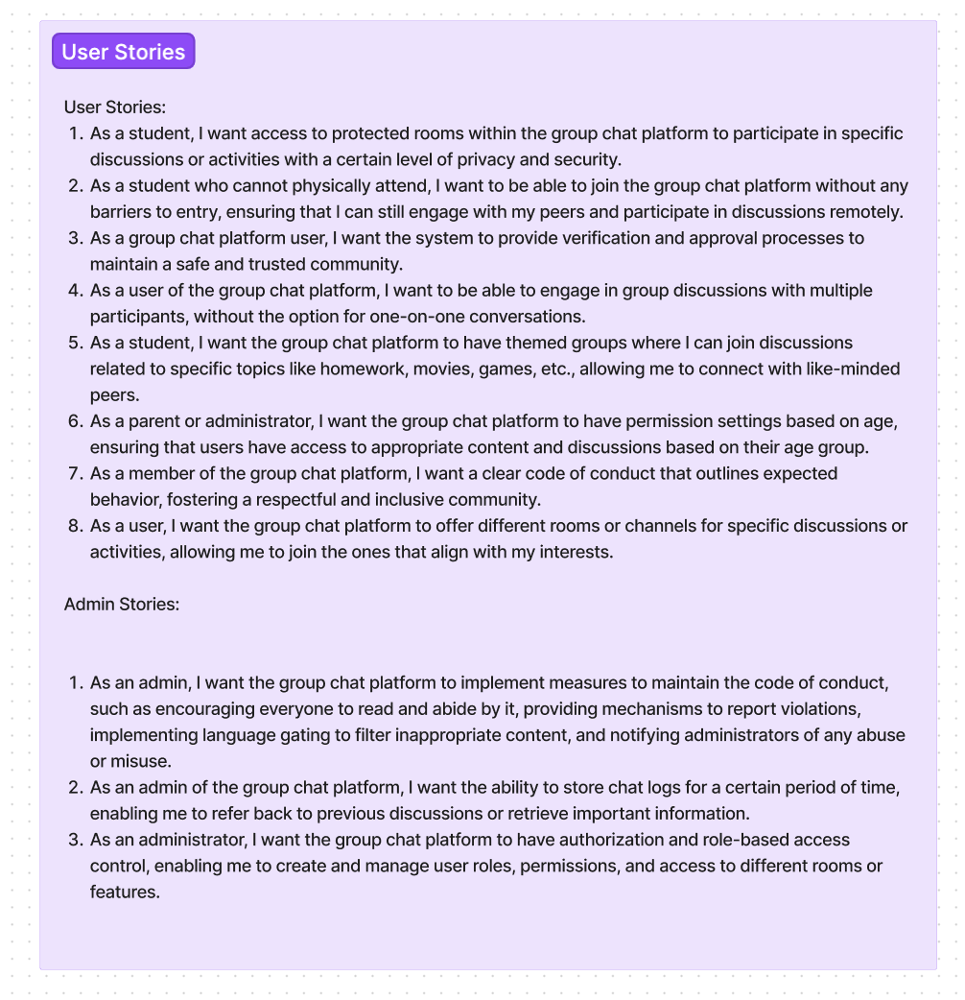
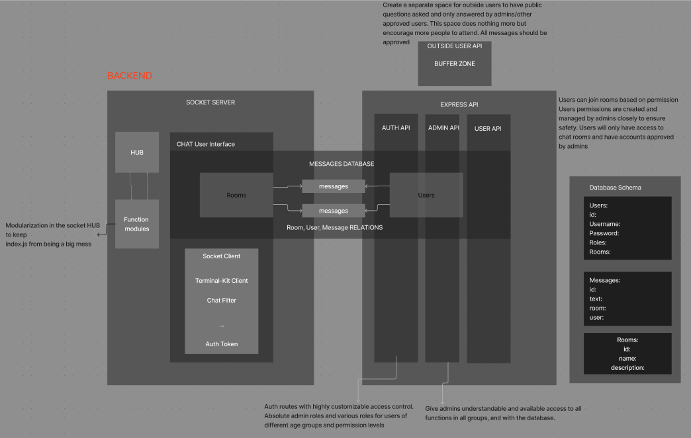

# youth-connect-backend

To create a safe space for interaction between users, where they can share, collaborate, and seek help with homework or related topics. The app aims to provide a platform that ensures privacy, data security, and user-friendly features for effective communication.

## Authors:

* [Ethan Storm](https://github.com/ShadowDraco)
* [Kaeden O'Meara](https://github.com/KaedenOC)
* [Eva Grace Smith](https://github.com/EvaGraceSmith)
*  [Coriana Williams](https://github.com/Coriana1)
* [Emmanuel Gonzales](https://github.com/Emmanuel-Gonzales)

### Links and Resources

- 
- 
- 
- 
- [Github Projects](https://github.com/orgs/YouthConnect/projects/1/views/1)

