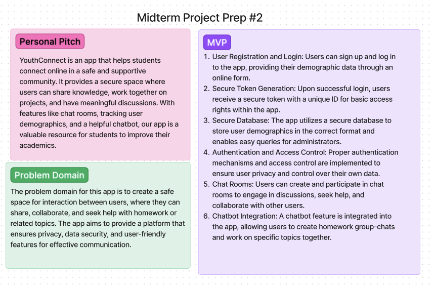

# youth-connect-backend

## The purpose of Youth Connect
To create a safe space for interaction between users, where they can share, collaborate, and seek help with homework or related topics. The app aims to provide a platform that ensures privacy, data security, and user-friendly features for effective communication. The greatest emphasis of the app is controlling interactions and groupd to keep everyone safe.

## Authors
- [Ethan Storm](https://github.com/ShadowDraco)
- [Kaeden O'Meara](https://github.com/KaedenOC)
- [Eva Grace Smith](https://github.com/EvaGraceSmith)
- [Coriana Williams](https://github.com/Coriana1)
- [Emmanuel Gonzales](https://github.com/Emmanuel-Gonzales)

## How to initialize/run your application (where applicable)
clone repo, `npm i`, then run `nodemon` in the terminal

## Routes
- Home route ("/") - Returns a "Home route!" message with a 200 status.
Parameter route ("/:model"): Handles the "model" parameter and sets the corresponding data module.
- Get all records ("/:model") - Retrieves all records of the specified model using the req.model.get() method and returns them as JSON with a 200 status.
- Get one record ("/:model/:id") - Retrieves a specific record by ID using the req.model.get(id) method and returns it as JSON with a 200 status.
- Create a new record ("/:model") - Creates a new record using the req.model.create(obj) method, passing the request body, and returns the created record as JSON with a 201 status.
- Update a record ("/:model/:id") - Updates a specific record by ID using the req.model.update(id, obj) method, passing the request body, and returns the updated record as JSON with a 200 status.
- Delete a record ("/:model/:id") - Deletes a specific record by ID using the req.model.delete(id) method and returns the deleted record as JSON with a 200 status.
- Create a new room ("/rooms") - Creates a new room record using the Room.create(roomData) method, passing the request body, and returns the created room as JSON with a 201 status.

## Tests
to run tests, after running `npm i`, run the command `npm test`
### Collaboration:
- [Ryan Galloway](https://github.com/rkgallaway)
- [Mark Smith](https://github.com/markmrsmith)
### Links and Resources
- 
- 
- 
- 

- [Github Projects](https://github.com/orgs/YouthConnect/projects/1/views/1)

